# Flatnotes-Enhanced

**A professional-grade, feature-rich fork of [Flatnotes](https://github.com/Dullage/flatnotes).**

Flatnotes-Enhanced elevates the original Flatnotes into a powerful, customizable, and user-friendly note-taking application. Designed for professionals and enthusiasts, it offers advanced organization, visual customization, and a seamless user experience—all while maintaining simplicity and performance.

> **Disclaimer:** This is a community fork with limited support. For basic Flatnotes issues, please refer to the [original Flatnotes documentation](https://github.com/Dullage/flatnotes).

---

## 📖 Table of Contents

- [Key Features](#-key-features)
- [Pages & Views](#-pages--views)
- [Settings Configuration](#️-settings-configuration)
- [Screenshots](#-screenshots)
- [Getting Started](#-getting-started)
- [Building the Docker Image](#-building-the-docker-image)
- [Manual Installation](#-manual-installation)
- [Environment Variables](#-environment-variables)
- [Known Issues & Roadmap](#-known-issues--roadmap)
- [License](#-license)
- [Acknowledgments](#-acknowledgments)

---

## ✨ Key Features

### 📁 Advanced Organization

| Feature | Description |
|---------|-------------|
| Dual Sidebars | Separate sidebars for folders and tags, with smooth toggle functionality. |
| Folder Management | Full nested folder support with auto-creation from note titles. |
| Bulk Operations | Select multiple notes and move them to existing or new folders. |
| Drag & Drop | Intuitive drag-and-drop for moving notes between folders. |
| Smart Counters | Real-time note counts for folders and tags. |

### 🏷️ Tag System

| Feature | Description |
|---------|-------------|
| Nested Tags | Hierarchical tag support (e.g., `#projects/ux`). |
| Custom Colors | Assign unique colors to tags with live preview. |
| Tag Sidebar | Searchable tag list with collapse/expand functionality. |
| Visual Chips | Pill-shaped tags with nested path display (e.g., `projects › ux`). |

### 📝 Enhanced Editor

| Feature | Description |
|---------|-------------|
| Custom Highlights | Colored text highlighting with picker and default colors. |
| Search & Replace | Full search/replace functionality (`Ctrl+H`). |
| Smart Autocomplete | Real-time suggestions for tags, callouts, variables, and task icons. |
| File Attachments | Support for PDF, DOCX, XLSX, TXT, RTF, Pages, and Numbers. |
| PDF Preview | In-browser preview for attached PDFs. |
| Modal Table Editor | Edit markdown tables in a dedicated modal interface. |
| Spreadsheet in Notes | Mini Excel-like spreadsheet support within notes. |

### 🎨 Visual Customization

| Feature | Description |
|---------|-------------|
| Callout Blocks | Obsidian-style callouts (`> [!note]`) with custom colors and icons. |
| Header Colors | Custom colors for H1-H6, with per-header enable/disable. |
| Table Styling | Custom header colors and zebra striping. |
| Quote Styling | Custom border and background colors (separate for light/dark mode). |
| Task Icons | Obsidian-style task markers (`- [>]`) with custom colors. |
| Nested Tasks | Collapsible nested tasks support with chevron marker. |
| Tag Colors | Per-tag color overrides with global enable/disable. |
| Custom Task Icons | Customize colors for Obsidian-style task markers (see Settings page). |

### 👁️ Preview System

| Feature | Description |
|---------|-------------|
| Note Popup Preview | Click the eye icon to preview notes without opening. |
| Full Rendering | Previews render callouts, tags, tables, and highlights. |
| Smart Positioning | Popup automatically positions near the clicked button. |
| Toggle Option | Enable/disable preview in settings. |

### 🗑️ Note Management

| Feature | Description |
|---------|-------------|
| Soft Delete | Notes move to `_trash` folder; not permanently deleted. |
| Trash Page | Browse, restore, or permanently delete trashed notes. |
| Archive | Move notes to `_archive` folder with automatic `#archived` tag. |
| Bookmarks | Pin important notes with `#pin` tag. |
| Templates | Save and reuse note templates from `_templates` folder. |

### 🔄 Navigation & UI

| Feature | Description |
|---------|-------------|
| Back/Forward | Navigate through recently viewed notes. |
| Home Button | Always-visible home button for quick access. |
| Mobile Optimized | Responsive design for all screen sizes. |
| Theme Toggle | Light/Dark/System theme with automatic OS detection. |

### 💾 Data & Storage

| Feature | Description |
|---------|-------------|
| SQLite Database | Persistent storage for user preferences and settings. |
| Metadata Sidecars | Creation/modification dates stored in `.meta.json` files. |
| JSON Migration | Automatic migration from legacy JSON settings. |
| Multi-User Ready | Database schema supports multiple users. |

### 🔐 Authentication

| Feature | Description |
|---------|-------------|
| TOTP Support | Two-factor authentication with QR code setup (on Login page). |
| Multiple Auth Types | None, Read-Only, Password, or TOTP. |

---

## 📋 Pages & Views

| Page | Purpose |
|------|---------|
| Home | Quick access to recently modified notes. |
| Search | Full-text search with sorting options. |
| Note Editor | WYSIWYG/Markdown editing with all enhancements. |
| Folders | Browse and manage notes by folder structure. |
| Tags | Browse and manage notes by tags. |
| Archive | View and restore archived notes. |
| Trash | Manage soft-deleted notes. |
| Bookmarks | View all pinned notes. |
| Templates | Manage note templates. |
| Attachments | Browse and delete file attachments. |
| Settings | Full customization interface. |

---

## ⚙️ Settings Configuration

| Tab | Configuration Options |
|-----|----------------------|
| Callouts | Create custom callout types with icons and colors. |
| Appearance | Header colors, highlight colors. |
| Advanced | Table styling, quote styling. |
| Tags | Global tag colors + per-tag overrides. |
| Task Icons | Custom colors for task markers. |
| Preferences | Display name, avatar, default sort, preview toggle. |

---

## 📸 Screenshots

> **Note:** Some Screenshots of the Enhanced Features

| Feature | Screenshot |
|---------|------------|
| Flatnotes-Enhanced Home Page | 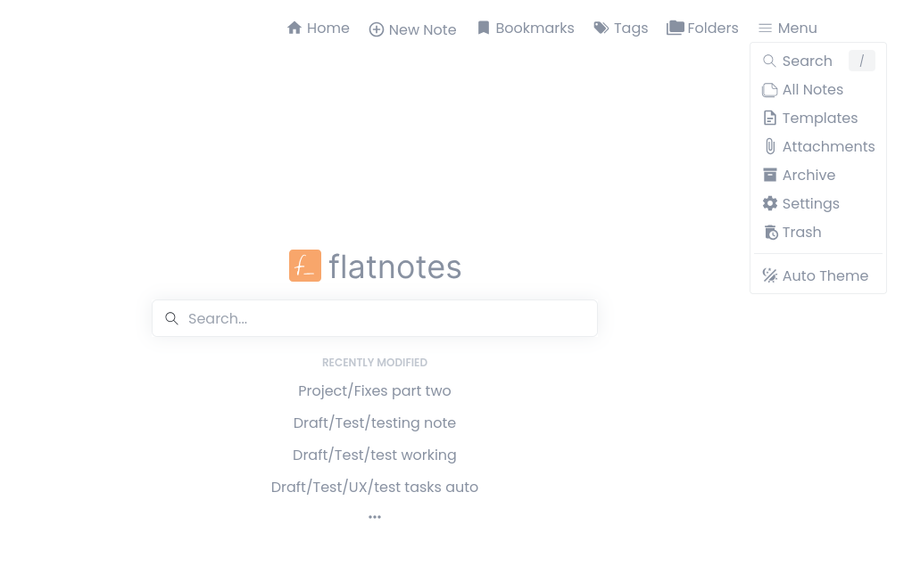 |
| Folder sidebar with drag & drop | 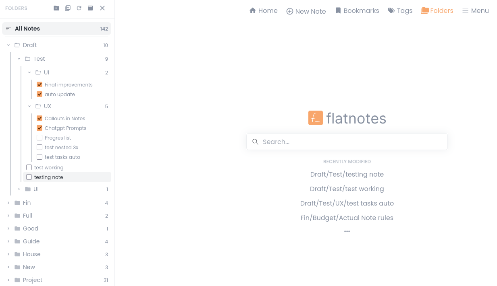 |
| Tag sidebar with color chips | 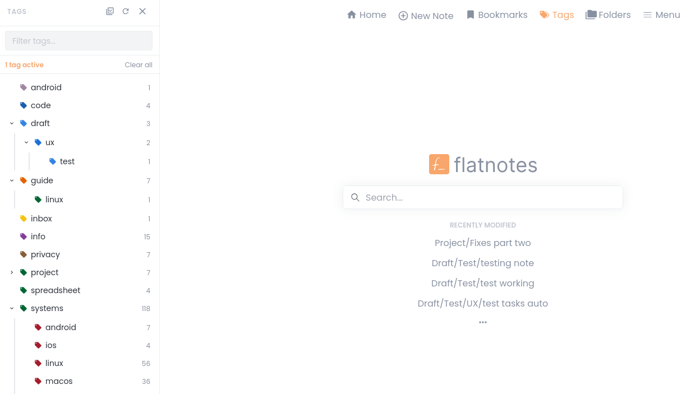 |
| Note popup preview | 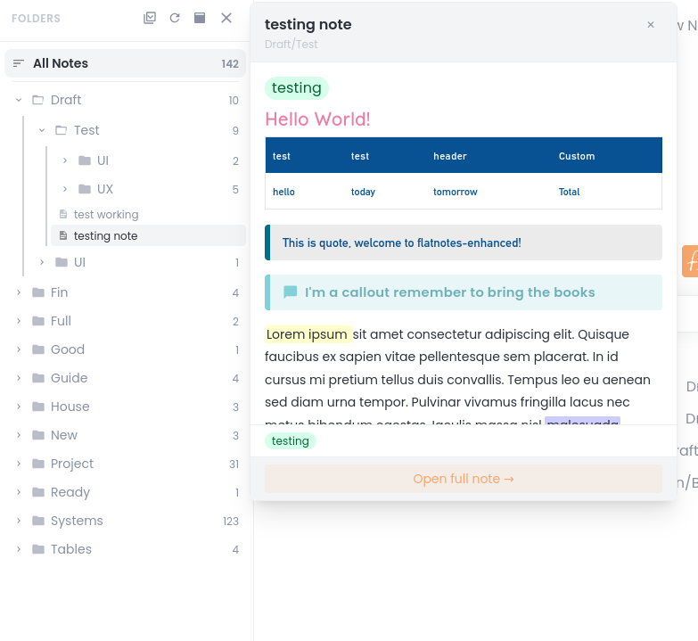 |
| Settings page (Callouts tab) | 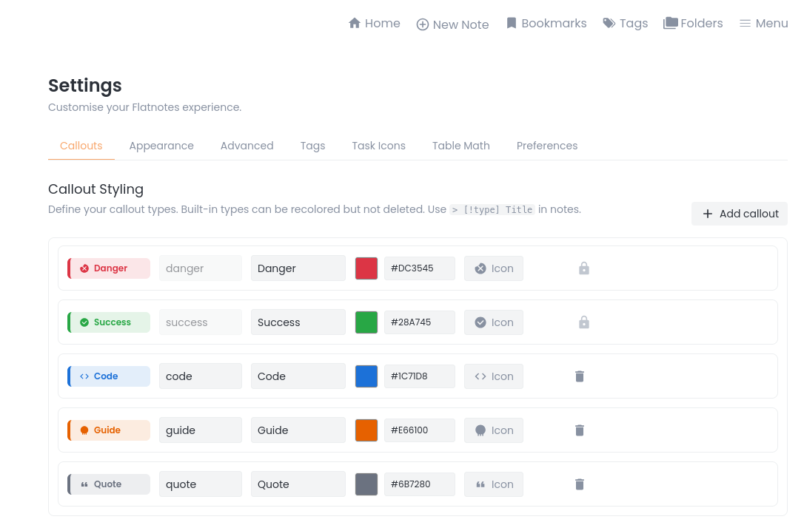 |
| Settings page (Appearances tab) | 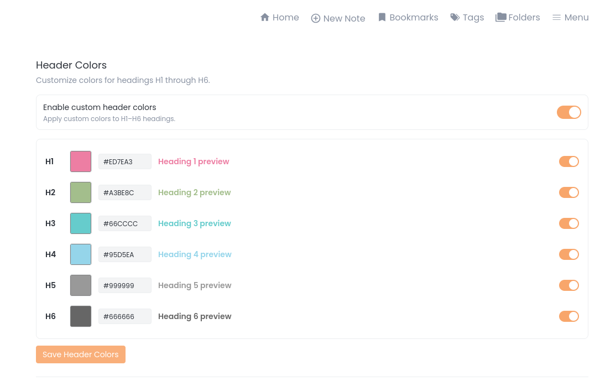, <br> 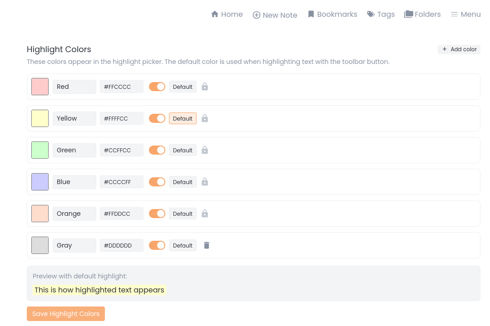 |
| Settings page (Advanced tab) | 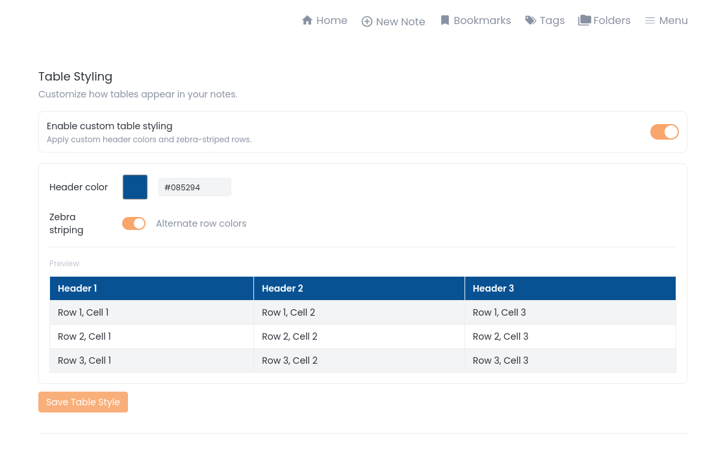, <br> 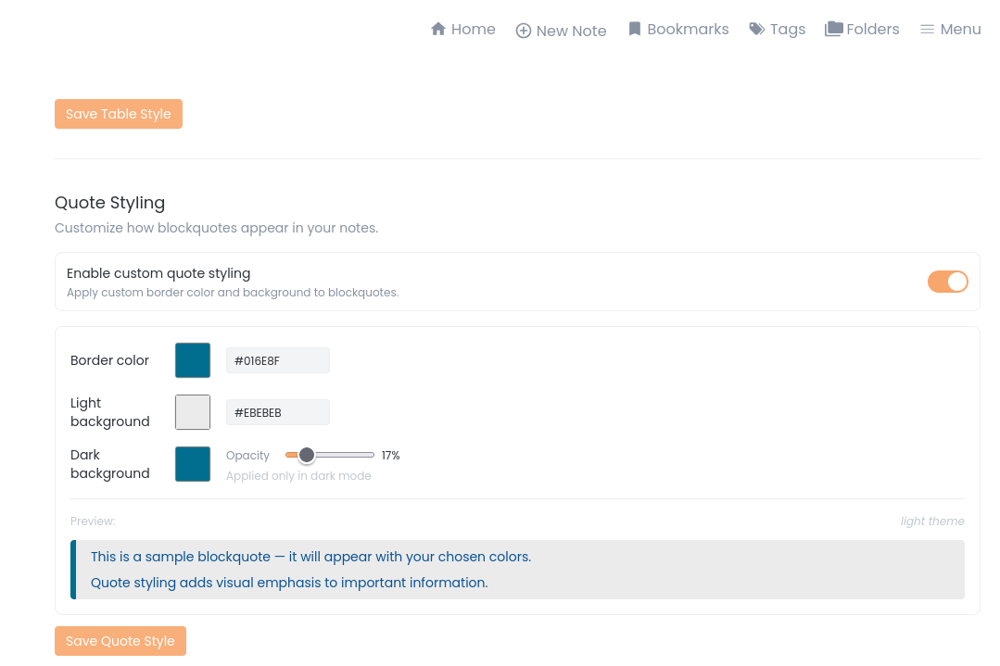 |
| Settings page (Tags tab) | 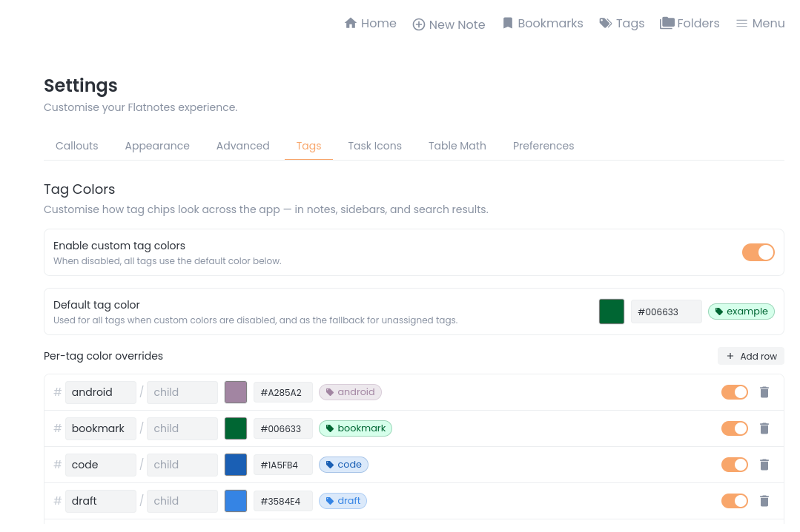, <br> 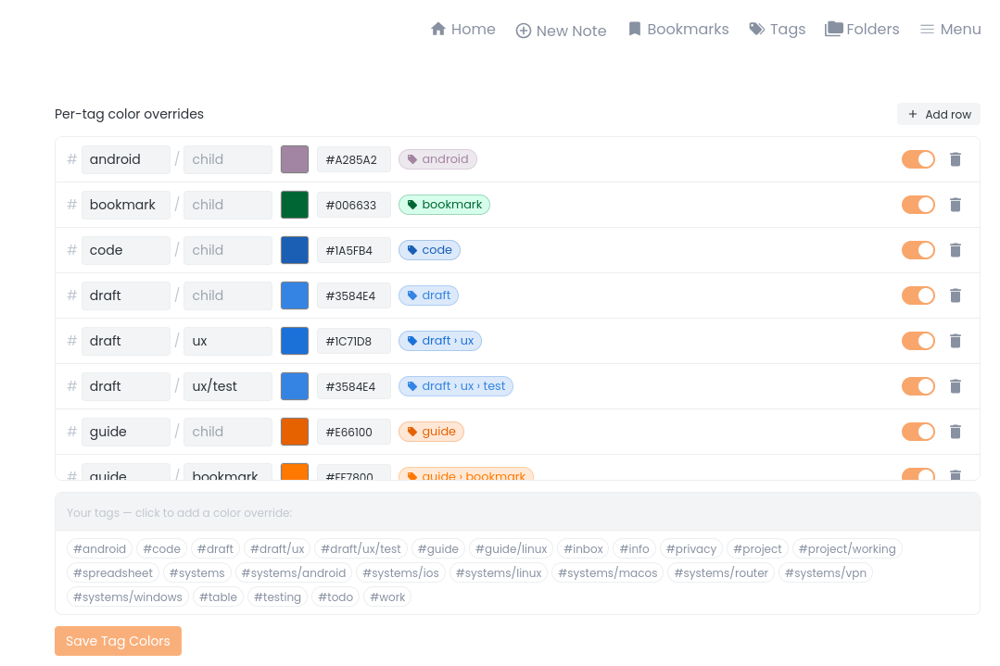 |
| Settings page (Task Icons tab) | 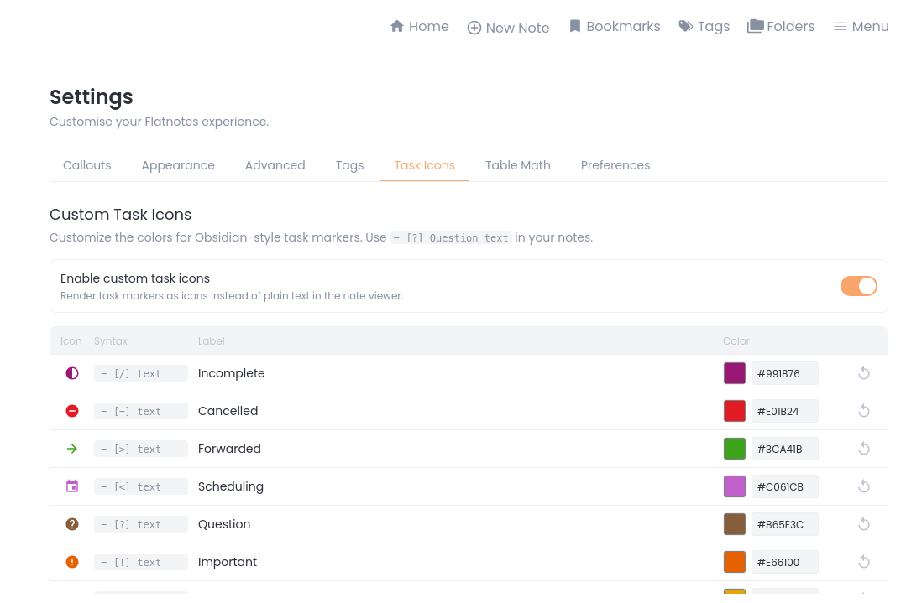, <br> 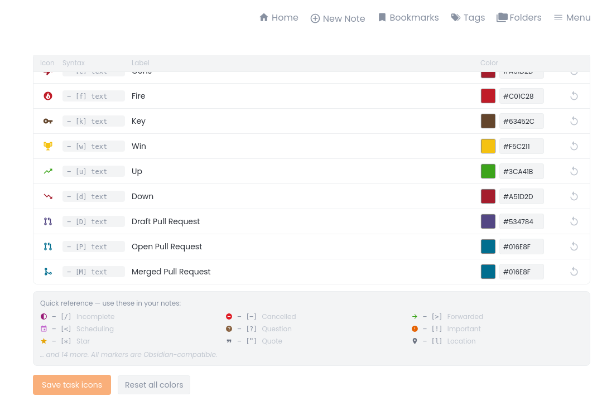 |
| Settings page (Account tab) | 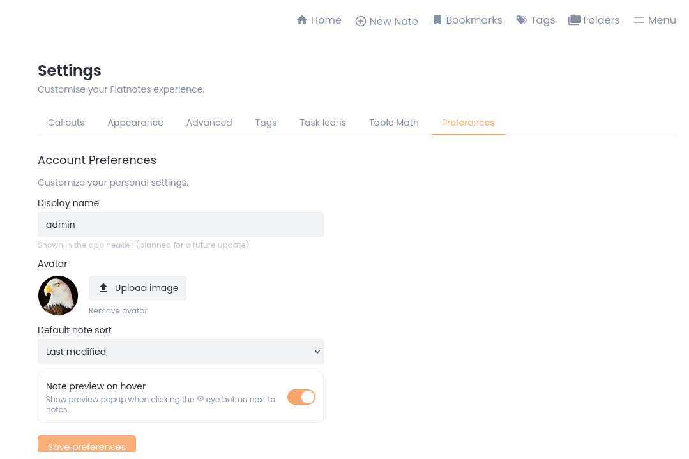 |

---

## 🚀 Getting Started

### Prerequisites

- Python 3.11+
- Node.js 20+
- (Optional) Docker for containerized deployment

---

## 🐳 Building the Docker Image

If you prefer to use Docker, you can build the image yourself:

```bash
# Clone the repository
git clone https://github.com/BobWs/flatnotes-enhanced.git
cd flatnotes-enhanced

# Build the Docker image
docker build -t flatnotes-enhanced:latest .

# Run the container
docker run -d \
  --name flatnotes-enhanced \
  -p 8080:8080 \
  -v "$(pwd)/data:/data" \
  -e "FLATNOTES_AUTH_TYPE=password" \
  -e "FLATNOTES_USERNAME=user" \
  -e "FLATNOTES_PASSWORD=changeMe!" \
  flatnotes-enhanced:latest
```

## 🐳 Docker

```bash
docker pull dockerbobw/flatnotes-enhanced:latest
docker run -d \
  --name flatnotes-enhanced \
  -p 8080:8080 \
  -v ./data:/data \
  -e "FLATNOTES_AUTH_TYPE=password" \
  -e "FLATNOTES_USERNAME=user" \
  -e "FLATNOTES_PASSWORD=changeMe!" \
  dockerbobw/flatnotes-enhanced:latest
```
---

## 📦 Manual Installation

### Step 1: Install Dependencies

**Backend (Python):**

```bash
# Install pipenv if you don't have it
pip install pipenv

# Install dependencies
pipenv install
```

**Frontend (Node.js):**

```bash
# Install dependencies
npm ci
```

### Step 2: Build the Frontend

```bash
npm run build
```

### Step 3: Run the Server

```bash
# Using pipenv
pipenv run uvicorn server.main:app --host 0.0.0.0 --port 8080

# Or using Python directly
python -m uvicorn server.main:app --host 0.0.0.0 --port 8080
```

### Step 4: Access Flatnotes-Enhanced

Open your browser and navigate to `http://localhost:8080`

---

## 🌍 Environment Variables

| Variable | Description | Default |
|----------|-------------|---------|
| `FLATNOTES_AUTH_TYPE` | Authentication type (`none`, `read_only`, `password`, `totp`) | `password` |
| `FLATNOTES_USERNAME` | Username for password authentication | (required) |
| `FLATNOTES_PASSWORD` | Password for password authentication | (required) |
| `FLATNOTES_SECRET_KEY` | Secret key for JWT tokens | (required) |
| `FLATNOTES_PATH` | Path to notes storage | `/data` |
| `FLATNOTES_HOST` | Host to bind the server to | `0.0.0.0` |
| `FLATNOTES_PORT` | Port to bind the server to | `8080` |
| `ENABLE_DATABASE` | Enable SQLite database for settings | `true` |
| `DATABASE_PATH` | Path to SQLite database file | `/data/.flatnotes/flatnotes.db` |
| `DATABASE_ECHO` | Enable database SQL logging | `false` |
| `LOGLEVEL` | Logging level (`DEBUG`, `INFO`, `WARNING`, `ERROR`) | `INFO` |

---

## 🐛 Known Issues & Roadmap

### Current Status

- ✅ All other features – stable

### Future Features

- Modal table editor – planned!
- Spreadsheet in notes – planned!
- Auto-delete trash after N days
- Multi-user support
- Automatic database backup
- Official Docker image on Docker Hub - planned!

---

## 📄 License

This project is a fork of [Flatnotes](https://github.com/Dullage/flatnotes) and retains its original license.

---

## 🙏 Acknowledgments

- Original [Flatnotes](https://github.com/Dullage/flatnotes) by [Dullage](https://github.com/Dullage)
- [Toast UI Editor](https://ui.toast.com/tui-editor) by NHN Cloud
- All contributors and testers

---

**Built with ❤️ for better note-taking.**
