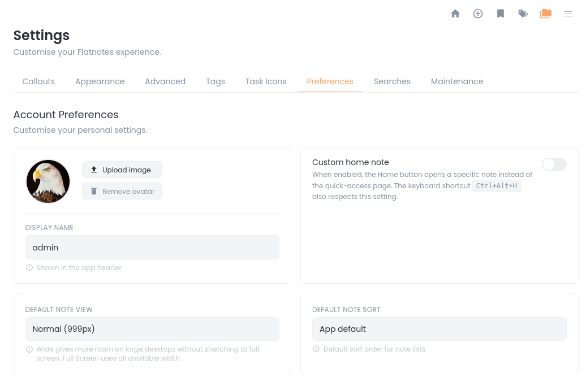
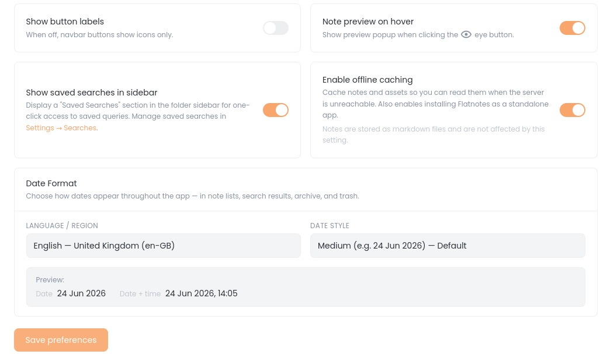
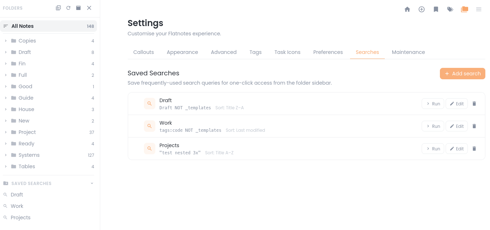
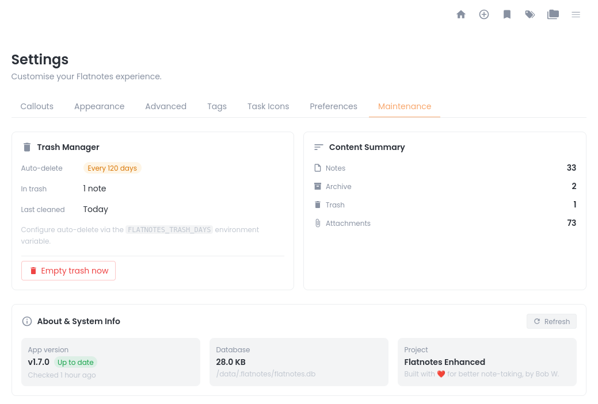
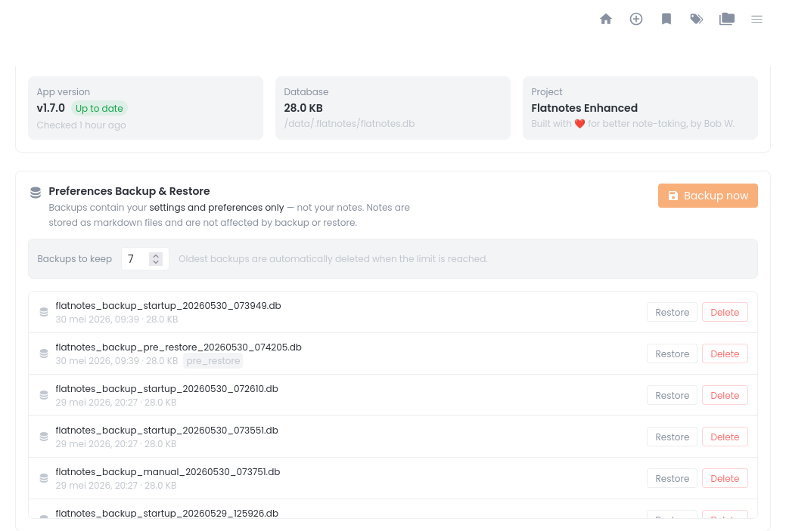
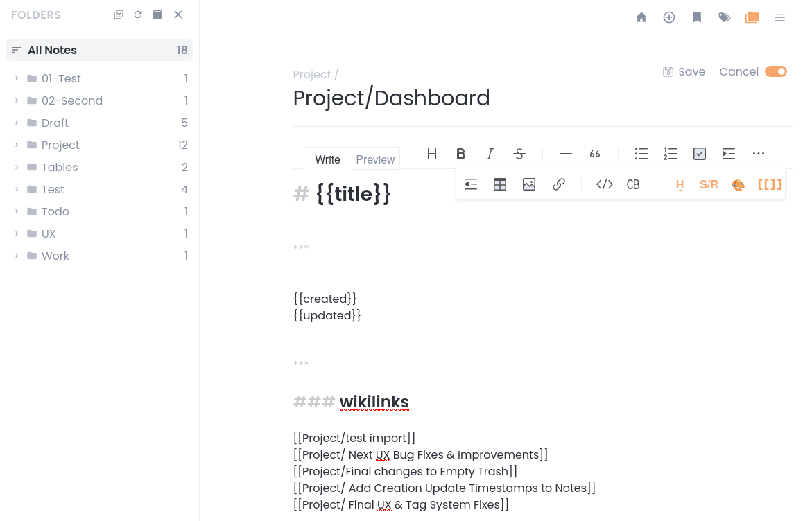
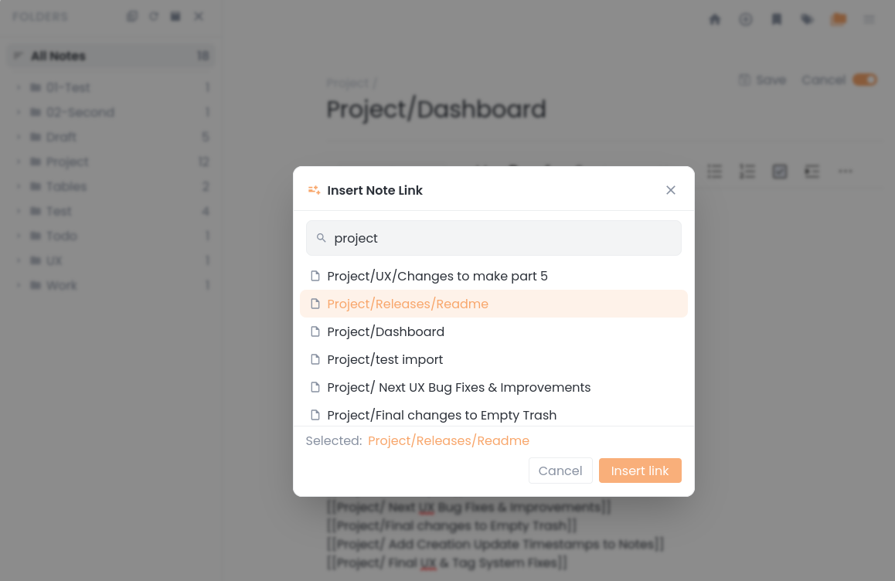

# Flatnotes-Enhanced

[](LICENSE)
[](https://github.com/BobWs/flatnotes-enhanced/releases)
[](https://hub.docker.com/r/dockerbobw/flatnotes-enhanced)


**A professional-grade, feature-rich fork of [Flatnotes](https://github.com/Dullage/flatnotes).**

Flatnotes-Enhanced elevates the original Flatnotes into a powerful, customizable, and user-friendly note-taking application. Designed for professionals and enthusiasts, it offers advanced organization, visual customization, and a seamless user experience—all while maintaining simplicity and performance.

> **Disclaimer:** This is a community fork with limited support. For basic Flatnotes issues, please refer to the [original Flatnotes documentation](https://github.com/Dullage/flatnotes).

---

## 📖 Table of Contents

- [Key Features](#-key-features)
- [Pages & Views](#-pages--views)
- [Settings Configuration](#️-settings-configuration)
- [Screenshots](#-screenshots)
- [Getting Started](#-getting-started)
- [Building the Docker Image](#-building-the-docker-image)
- [Manual Installation](#-manual-installation)
- [Environment Variables](#-environment-variables)
- [Known Issues & Roadmap](#-known-issues--roadmap)
- [License](#-license)
- [Acknowledgments](#-acknowledgments)

---

## 🆕 What's New in v1.11.0

- **Showcase Mode** – Transform your instance into a public read-only note viewer (`FLATNOTES_SEARCH_DISABLED=true`). Perfect for sharing curated notes with the world.

- View [full changelog](https://github.com/BobWs/flatnotes-enhanced/releases) latest version
- See the [Changelog](CHANGELOG.md) file for complete version history.

---

## ✨ Key Features

### 📁 Advanced Organization

| Feature | Description |
|---------|-------------|
| Dual Sidebars | Separate sidebars for folders and tags, with smooth toggle functionality. |
| Folder Management | Full nested folder support with auto-creation from note titles. |
| Bulk Operations | Select multiple notes and move them to existing or new folders. |
| Drag & Drop | Intuitive drag-and-drop for moving notes between folders. |
| Smart Counters | Real-time note counts for folders and tags. |
| Duplicate Notes | Copy one or more notes to any folder; originals remain untouched. Smart naming resolves conflicts automatically (Report (copy), Report (copy 2), etc.). |
| Bulk Delete | Soft-delete multiple notes at once from the sidebar. Notes go to _trash and can be restored later. |

### 🏷️ Tag System

| Feature | Description |
|---------|-------------|
| Nested Tags | Hierarchical tag support (e.g., `#projects/ux`). |
| Custom Colors | Assign unique colors to tags with live preview. |
| Tag Sidebar | Searchable tag list with collapse/expand functionality. |
| Visual Chips | Pill-shaped tags with nested path display (e.g., `projects › ux`). |
| Clean Tagging | Tags must start with a letter – no more hex colors, port numbers, or config comments cluttering your sidebar.|

### 📝 Enhanced Editor

| Feature | Description |
|---------|-------------|
| Custom Highlights | Colored text highlighting with picker and default colors. |
| Search & Replace | Full search/replace functionality (`Ctrl+H`). |
| Smart Autocomplete | Real-time suggestions for tags, callouts, variables, and task icons. |
| File Attachments | Support for 40+ file types – documents (`DOCX, ODT, TXT`), spreadsheets (`XLSX, CSV`), presentations (`PPTX`), archives (`ZIP, RAR, 7Z`), audio (`MP3, WAV, FLAC`), video (`MP4, MKV, MOV`), code files (`JS, PY, HTML, JSON`), and more. Proper icons and colours for each category. |
| PDF Preview | In-browser preview for attached PDFs. |
| Wikilink Popup Modal | Insert wikilinks using a searchable popup modal |

### 🎨 Visual Customization

| Feature | Description |
|---------|-------------|
| Callout Blocks | Obsidian-style callouts (`> [!note]`) with custom colors and icons. |
| Header Colors | Custom colors for H1-H6, with per-header enable/disable. |
| Table Styling | Custom header colors and zebra striping. |
| Quote Styling | Custom border and background colors (separate for light/dark mode). |
| Task Icons | Obsidian-style task markers (`- [>]`) with custom colors. |
| Nested Tasks | Collapsible nested tasks support with chevron marker. |
| Tag Colors | Per-tag color overrides with global enable/disable. |
| Custom Task Icons | Customize colors for Obsidian-style task markers (see Settings page). |

### 👁️ Preview System

| Feature | Description |
|---------|-------------|
| Note Popup Preview | Click the eye icon to preview notes without opening. |
| Full Rendering | Previews render callouts, tags, tables, and highlights. |
| Smart Positioning | Popup automatically positions near the clicked button. |
| Toggle Option | Enable/disable preview in settings. |

### 🗑️ Note Management

| Feature | Description |
|---------|-------------|
| Soft Delete | Notes move to `_trash` folder; not permanently deleted. |
| Trash Page | Browse, restore, or permanently delete trashed notes. |
| Archive | Move notes to `_archive` folder with automatic `#archived` tag. |
| Bookmarks | Pin important notes with `#pin` tag. |
| Templates | Save and reuse note templates from `_templates` folder. |

### 🔄 Navigation & UI

| Feature | Description |
|---------|-------------|
| Back/Forward | Navigate through recently viewed notes. |
| Home Button | Always-visible home button for quick access. |
| Mobile Optimized | Responsive design for all screen sizes. |
| Theme Toggle | Light/Dark/System theme with automatic OS detection. |
| Preferences | Display name, avatar, default sort, note preview toggle, button label toggle, custom home note. |

### 💾 Data & Storage

| Feature | Description |
|---------|-------------|
| SQLite Database | Persistent storage for user preferences and settings. |
| Metadata Sidecars | Creation/modification dates stored in `.meta.json` files. |
| JSON Migration | Automatic migration from legacy JSON settings. |
| Multi-User Ready | Database schema supports multiple users. |
| Multi-Instance Support | Run **two or more Flatnotes-Enhanced instances** on the same server. |

### 🔐 Authentication

| Feature | Description |
|---------|-------------|
| TOTP Support | Two-factor authentication with QR code setup (on Login page). |
| Multiple Auth Types | None, Read-Only, Password, or TOTP. |
| Non-ASCII Support | Usernames and passwords support umlauts (ä, ö, ü, ß) and accented characters. |
| Showcase Mode | **For public instances:** Use `FLATNOTES_AUTH_TYPE=read_only` together with `FLATNOTES_SEARCH_DISABLED=true` to create a genuinely read-only showcase instance. |

---

## 📋 Pages & Views

| Page | Purpose |
|------|---------|
| Home | Quick access to recently modified notes. |
| Search | Full-text search with sorting options. |
| Note Editor | WYSIWYG/Markdown editing with all enhancements. |
| Folders | Browse and manage notes by folder structure. |
| Tags | Browse and manage notes by tags. |
| Archive | Browse, search, sort, and restore archived notes. Empty archive with confirmation. |
| Trash | Manage soft-deleted notes. |
| Bookmarks | View all pinned notes. |
| Templates | Manage note templates. |
| Attachments | Browse, search, filter, and sort file attachments. Category badges show file types at a glance. |
| Settings | Full customization interface. |

---

## ⚙️ Settings Configuration

| Tab | Configuration Options |
|-----|----------------------|
| Callouts | Create custom callout types with icons and colors. |
| Appearance | Header colors, highlight colors. |
| Advanced | Table styling, quote styling. |
| Tags | Global tag colors + per-tag overrides. |
| Task Icons | Custom colors for task markers. |
| Preferences | Display name, avatar, default sort, note view, note preview toggle, button label toggle, custom home note, offline caching (PWA), **show saved searches in sidebar**, date formatting (locale + style). |
| Searches | Create, edit, delete, and reorder saved searches. Run searches directly from the Settings page. |
| Maintenance | Trash manager, content summary, backups, version check, system info. |

---

## 📸 Screenshots

> **Note:** Some Screenshots of the Enhanced Features

| Feature | Screenshot |
|---------|------------|
| Flatnotes-Enhanced Home Page |  |
| Folder sidebar with drag & drop |  |
| Tag sidebar with color chips |  |
| Note popup preview |  |
| Settings page (Callouts tab) |  |
| Settings page (Appearances tab) | , <br>  |
| Settings page (Advanced tab) | , <br>  |
| Settings page (Tags tab) | , <br>  |
| Settings page (Task Icons tab) | , <br>  |
| Settings page (Account tab) | , <br>  |
| Settings page (Searches tab) |  |
| Settings page (Maintenance tab) | , <br>  |
| Note Editor (insert wikilink) | , <br>   |
---

## 🚀 Getting Started

### Prerequisites

- Python 3.11+
- Node.js 20+
- (Optional) Docker for containerized deployment

---

## 🐳 Building the Docker Image

If you prefer to use Docker, you can build the image yourself:

```bash
# Clone the repository
git clone https://github.com/BobWs/flatnotes-enhanced.git
cd flatnotes-enhanced

# Build the Docker image
docker build -t flatnotes-enhanced:latest .

# Run the container
docker run -d \
  --name flatnotes-enhanced \
  -p 8080:8080 \
  -v "$(pwd)/data:/data" \
  -e "FLATNOTES_AUTH_TYPE=password" \
  -e "FLATNOTES_USERNAME=user" \
  -e "FLATNOTES_PASSWORD=changeMe!" \
  flatnotes-enhanced:latest
```

## 🐳 Docker

**Supports `linux/amd64` and `linux/arm64` (Raspberry Pi, Apple Silicon).**

```bash
docker pull dockerbobw/flatnotes-enhanced:latest
docker run -d \
  --name flatnotes-enhanced \
  -p 8080:8080 \
  -v ./data:/data \
  -e "FLATNOTES_AUTH_TYPE=password" \
  -e "FLATNOTES_USERNAME=user" \
  -e "FLATNOTES_PASSWORD=changeMe!" \
  dockerbobw/flatnotes-enhanced:latest
```
---

## 📦 Manual Installation

### Step 1: Install Dependencies

**Backend (Python):**

```bash
# Install pipenv if you don't have it
pip install pipenv

# Install dependencies
pipenv install
```

**Frontend (Node.js):**

```bash
# Install dependencies
npm ci
```

### Step 2: Build the Frontend

```bash
npm run build
```

### Step 3: Run the Server

```bash
# Using pipenv
pipenv run uvicorn server.main:app --host 0.0.0.0 --port 8080

# Or using Python directly
python -m uvicorn server.main:app --host 0.0.0.0 --port 8080
```

### Step 4: Access Flatnotes-Enhanced

Open your browser and navigate to `http://localhost:8080`

---

## 🌍 Environment Variables

| Variable | Description | Default |
|----------|-------------|---------|
| `FLATNOTES_AUTH_TYPE` | Authentication type (`none`, `read_only`, `password`, `totp`) | `password` |
| `FLATNOTES_USERNAME` | Username for password authentication | (required) |
| `FLATNOTES_PASSWORD` | Password for password authentication | (required) |
| `FLATNOTES_SECRET_KEY` | Secret key for JWT tokens | (required) |
| `FLATNOTES_PATH` | Path to notes storage | `/data` |
| `FLATNOTES_HOST` | Host to bind the server to | `0.0.0.0` |
| `FLATNOTES_PORT` | Port to bind the server to | `8080` |
| `FLATNOTES_TRASH_DAYS` | Auto-delete trash older than N days (0 = disabled) | `0` |
| `ENABLE_DATABASE` | Enable SQLite database for settings | `true` |
| `DATABASE_PATH` | Path to SQLite database file | `/data/.flatnotes/flatnotes.db` |
| `DATABASE_ECHO` | Enable database SQL logging | `false` |
| `LOGLEVEL` | Logging level (`DEBUG`, `INFO`, `WARNING`, `ERROR`) | `INFO` |
| `FLATNOTES_SEARCH_DISABLED` | Disable search and hide UI elements (Showcase Mode) | `false` |

---

## 💾 Preferences Backup & Restore

Your preferences (colors, callouts, tag settings, appearance, etc.) are automatically backed up daily. Backups are stored in `/data/.flatnotes/backups/`.

| Feature | Description |
|---------|-------------|
| **Automatic backups** | Created once per calendar day on app startup |
| **Retention** | Keep last N backups (default 7) – auto-pruned |
| **Manual backup** | Click "Backup now" in Maintenance tab |
| **Restore** | Select any backup and confirm (requires typing `RESTORE`) |
| **Safety** | Automatic `pre_restore` backup before any restore operation |

> **Note:** Backups contain **settings only** – your notes are stored as plain markdown files and are never touched by backup/restore.

---

## 🐛 Known Issues & Roadmap

### Known Limitations

- **Numbered tags** – Tags must start with a letter (e.g., `#project123` instead of `#123`). If you need numbered tags, please open a discussion and I'll consider adding a preference option.

### Current Status

- ✅ All other features – stable

## Tags

- `latest` – newest version (multi-arch: `linux/amd64` + `linux/arm64`)
- `v1.11.0` – **Showcase Mode** (`FLATNOTES_SEARCH_DISABLED`) – public read-only presentation layer for sharing curated notes
- `v1.10.0` – Saved Searches, Title Z–A Sort, NavBar spacing reduction, Tag Pollution Fix
- `v1.9.0` – Customisable Date Formatting – choose locale and style (Short/Medium/Long)
- `v1.8.0` – Progressive Web App (PWA) – offline read-only access, installable as standalone app
- `v1.7.2` – Non-ASCII characters in usernames and passwords (umlauts, accented characters)
- `v1.7.1` – Bug fixes: backup list clarity + more reliable version check (Docker Hub API)
- `v1.7.0` – Redesigned Archive Page, Maintenance Tab, Preferences Backup & Restore, Live Version Check
- `v1.6.3` – Bug fixes: sidebar expand/collapse (deep nesting, individual toggles) + header colors/font now respect user preferences
- `v1.6.2` – Consistent default sorting: all "All Notes" entry points respect your preference
- `v1.6.1` – Bug fix: title truncation in editor header
- `v1.6.0` – Note Views: Normal (999px), Wide (1400px), Full Screen
- `v1.5.1` – Bug fixes: case-insensitive attachments + archive folder scanning
- `v1.5.0` – New: Wikilink Popup Modal – Link notes without typing
- `v1.4.2` – Bug fix: note switching while editing (clean editor close)
- `v1.4.1` – Attachment System Overhaul + Attachments Page redesign (search, filter, sort)
- `v1.4.0` – New: Custom Home Note + Preferences tab redesign
- `v1.3.0` – Multi-Instance Support (run two or more Flatnotes-Enhanced instances on the same server)
- `v1.2.0` – Button Label Toggle & UI Polish
- `v1.1.0` – Duplicate notes + bulk delete
- `v1.0.2` – multi-arch support (ARM64)
- `v1.0.1` – bug fix release (amd64 only)
- `v1.0.0` – first stable release (amd64 only)

## Multi-Instance Setup

Running separate instances for work and personal notes? Flatnotes-Enhanced fully
supports multi-instance deployment on the same server.

- **Unique storage keys** – No session bleed, no cache conflicts
- **Works with TOTP** – Each instance has its own 2FA secret
- **Any reverse proxy** – Nginx, Caddy, Nginx Proxy Manager

📖 **[Full multi-instance guide](MULTI_INSTANCE.md)**


## Custom Home Note

Want to land on your dashboard, weekly planner, or project overview every time you open the app? Set any note as your personal start page.

* **Loads on app start** — no extra click needed
* **Home button always navigates there** — so does `Ctrl+Alt+H`
* **Works with folder paths** — e.g. `Work/Weekly` or `Projects/Dashboard`
* **Opt-in** — users who prefer the default quick-access home page are unaffected

**Setup:** Settings → Preferences → Custom home note → toggle on → enter note title → Save.


## PWA Offline Access

Flatnotes-Enhanced can be installed as a Progressive Web App (PWA) and caches notes for offline access.

**To enable:**
1. Go to **Settings → Preferences**
2. Toggle **"Enable offline caching (PWA)"**
3. Install the app from your browser (Chrome/Edge: address bar install icon)

**What works offline:**
- Reading notes you've opened before
- Browsing folders and tags
- Searching cached content

**What doesn't work offline:**
- Editing or creating notes
- Attachments
- Content you haven't viewed while online

**How it works:**
- The app checks server reachability every 15 seconds
- An amber banner appears when offline
- Cache clears automatically when you disable the feature

> **Note:** Offline access is read-only. For full functionality, you need a server connection.


## Date Formatting

Flatnotes-Enhanced supports customisable date formatting through **Settings → Preferences**.

- **Locale** – Choose your preferred language/region (Dutch, English GB/US, German, French, Spanish, and more)
- **Style** – Short (24/06/2026), Medium (24 Jun 2026), or Long (24 June 2026)

Dates across the entire app (search results, note lists, archive, trash, etc.) will update to match your preferences.


## Saved Searches

Save your most-used search queries and access them with one click.

**To enable:**

1. Go to **Settings → Searches** to create your saved searches
2. Toggle **"Show saved searches in sidebar"** in Settings → Preferences
3. Your saved searches appear in a collapsible section below your folders in the sidebar

**Each saved search stores:**
- A name (e.g., "Work Notes")
- A search query (e.g., `tags:work`)
- An optional default sort order

**Sidebar features:**
- Click any saved search to run it instantly
- Active saved search is highlighted

**Settings features:**
- Create, edit, delete saved searches
- Run any saved search directly from the Settings page
- Drag and drop to reorder


## Showcase Mode (Public Read-Only)

Transform a Flatnotes-Enhanced instance into a clean, read-only note viewer for public audiences. Perfect for sharing curated notes, documentation, or blog posts.

### How to enable

**Set the following environment variable:**

```env
FLATNOTES_SEARCH_DISABLED=true
```

**Recommended for public instances:**

```env
FLATNOTES_AUTH_TYPE=read_only
FLATNOTES_SEARCH_DISABLED=true
FLATNOTES_QUICK_ACCESS_HIDE=true   # optional: keeps home page minimal
```

### What changes

| Feature | Normal mode | Showcase mode |
|---------|-------------|---------------|
| Search | ✅ Available | ❌ Disabled (returns empty results) |
| Edit/Create/Delete | ✅ Available | ❌ Hidden (UI-level) |
| New Note button | ✅ Available | ❌ Hidden |
| Settings/Trash/Archive | ✅ Available | ❌ Hidden |
| Tags sidebar | ✅ Available | ❌ Hidden |
| Bookmarks | ✅ Available | ❌ Hidden |
| Note viewer | ✅ Full | ✅ Read-only (navigation only) |
| Folder sidebar | ✅ Full | ✅ Navigation only (expand, collapse) |
| Direct note URLs | ✅ Available | ✅ Still work |

### ⚠️ Important Security Note

**Showcase Mode is a UI restriction, not a security control.**

- API endpoints are still accessible to anyone who knows the URL structure
- Notes can be retrieved by guessing their titles
- Attachments are not protected

**Always use with `FLATNOTES_AUTH_TYPE=read_only`** for public instances. For truly sensitive content, use network-level restrictions (reverse proxy authentication, VPN, IP allowlisting).

---

### Future Features

- Wikilink Popup Modal - done!
- Auto-delete trash after N days - done!
- Automatic database backup - done!
- Modal table editor – planned!
- Spreadsheet in notes – planned!
- Multi-user support

---

## 📄 License

This project is a fork of [Flatnotes](https://github.com/Dullage/flatnotes) and retains its original license.

---

## 🙏 Acknowledgments

- Original [Flatnotes](https://github.com/Dullage/flatnotes) by [Dullage](https://github.com/Dullage)
- [Toast UI Editor](https://ui.toast.com/tui-editor) by NHN Cloud
- All contributors and testers

---

**Built with ❤️ for better note-taking.**